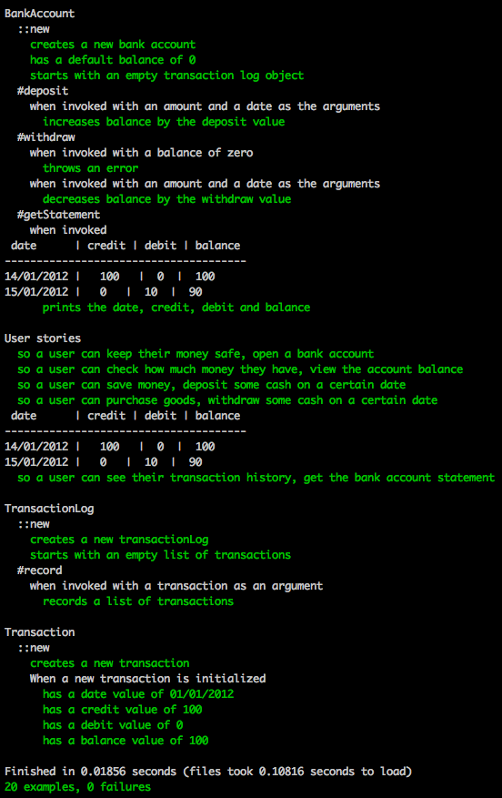

# Bank practice tech test

This is a ruby program that can be run in irb or pry, which has the following
functionality developed using TDD and using OO principles:
(See Specification below for more details).

## Getting started
Enter the following commands in your terminal to download the program:
- `git clone https://github.com/shezdev/bank_tech_test.git`
- cd into the bank_tech_test directory
- Please run `bundle` to install the necessary ruby `gemfile` dependencies

## Usage
- Type the command `pry` in your terminal to run the example tests provided in .pryrc
- Alternatively, open `irb` and enter the following commands:

```
> bc = BankAccount.new

 => #<BankAccount:0x007fac528b0f78 @balance=0, @log=#<TransactionLog:0x007fac528b0f50 @transactions=[]>>
```
```
> bc.deposit("01/01/2012", 100)
 => [{:date=>"01/01/2012", :credit=>100, :debit=>0, :balance=>100}]
```

```
> bc.withdraw("02/01/2012", 10)
 => [{:date=>"01/01/2012", :credit=>100, :debit=>0, :balance=>100}, {:date=>"02/01/2012", :credit=>0, :debit=>10, :balance=>90}]
```

```
> bc.getStatement
 date      | credit | debit | balance
--------------------------------------
01/01/2012 |   100   |  0  |  100
02/01/2012 |   0   |  10  |  90
```

NOTE: The following commands will cause the program to exit with the message:
"Withdrawal denied: insufficient funds"
`bc = BankAccount.new`
`bc.withdraw("02/01/2012", 10)`

## Running tests

Use the command `rspec`to run tests



## Specification

### Requirements

* You should be able to interact with the your code via a REPL like IRB or the JavaScript console.  (You don't need to implement a command line interface that takes input from STDIN.)
* Deposits, withdrawal.
* Account statement (date, amount, balance) printing.
* Data can be kept in memory (it doesn't need to be stored to a database or anything).

### Acceptance criteria

**Given** a client makes a deposit of 1000 on 10-01-2012
**And** a deposit of 2000 on 13-01-2012
**And** a withdrawal of 500 on 14-01-2012
**When** she prints her bank statement
**Then** she would see

```
date       || credit || debit   || balance
14/01/2012 ||        || 500.00  || 2500.00
13/01/2012 || 2000.00||         || 3000.00
10/01/2012 || 1000.00||         || 1000.00
```

## User Stories
```
As a user
So that I can keep my money somewhere safe
I'd like to open a bank account
```
```
As a user
So that I know how much I can spend this month
I'd like to see my account balance
```
```
As a user
So that I can save money for a rainy day
I'd like to deposit some cash in my bank account
```
```
As a user
So that I can pay for my groceries
I'd like to withdraw some cash from my account
```
```
As a user
So that I can see what I've saved and spent this month
I'd like to see my bank account statement with dates for each transaction
```
